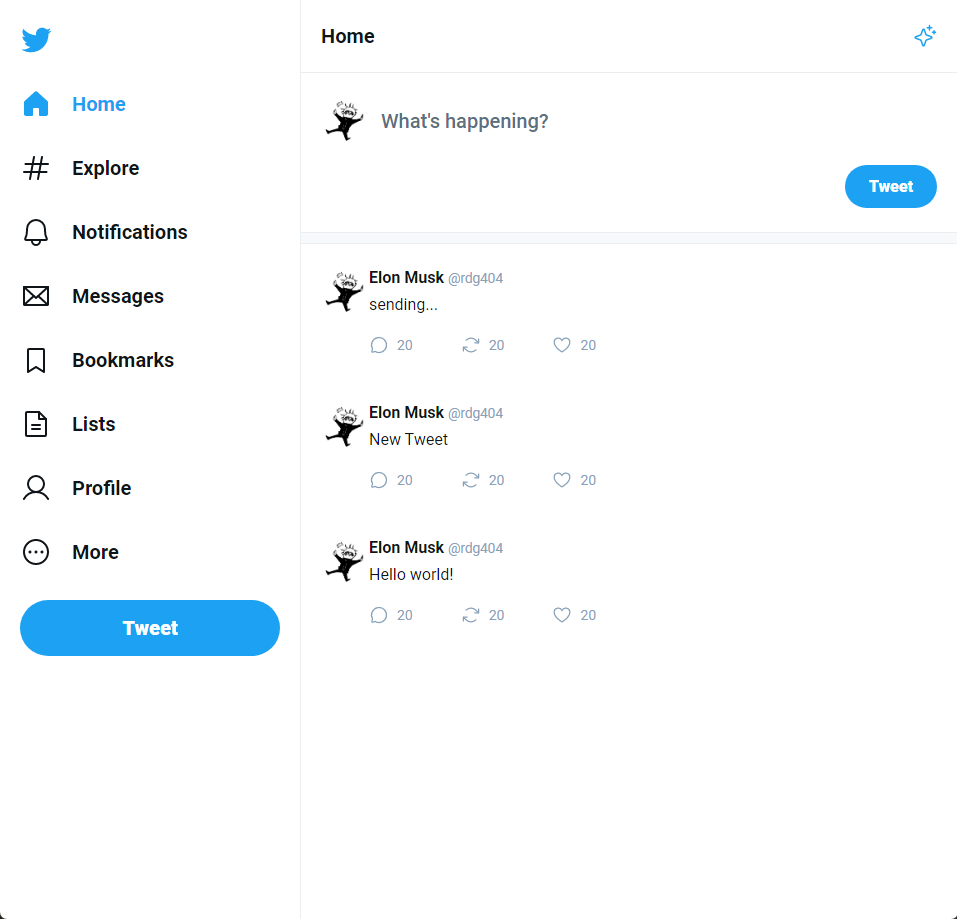
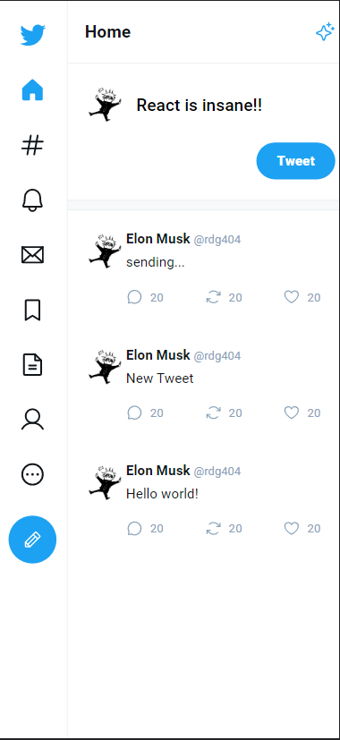
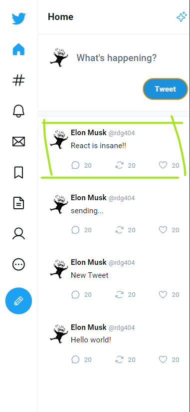

<h1 align="center">Template Twitter</h1>
### Projeto desenvolvido durante a masterclass, disponibilizada pela Rocketseat.

<br><br>
## Como executar a aplicação ⚙️

### Executar os seguintes comandos...

``` js
  npm install
```
- Para instalar as dependências da aplicação

``` js
  npm run dev
```
- Para executar a aplicação
<br><br>


## O que foi desenvolvido 🚀
Página inicial do twitter, página de responder tweets, além da versão mobile 

<h3 align="center">Página inicial (Versão desktop)</h3>



<h3 align="center">Enviando Tweet... (Versão mobile)</h3>
<div align="center"></div>

<div align="center"></div>


<h3 align="center">Página de respostas de tweets (Versão mobile)</h3>

<div align="center"></div>


<br><br>
## Como foi desenvolvido 📋

### Tecnologias utilizadas
- ReactJS
- Vite
- VsCode


## Agradecimentos ❤️

[Rocketseat](https://github.com/Rocketseat) por promover a masterclass, gratuitamente.
[Diego Fernandes](https://github.com/diego3g) por ter ministrado a aula.


Layout figma [here](https://www.figma.com/file/4JXgzLf4GpIuvV6GGXNwiN/Twitter-UI-(Community)?node-id=1%3A937&t=gfmieQAcbbBHbMdN-0)


<br><br><br><br>

Não liga, são minhas anotações 😊

* Fluxo de renderização: <br><br><br>

- 1 Toda vez que alteramos o estado de um componente, TODO componente é renderizado

- 2 Toda vez que o seu componene PAI renderizar

- 3 Toda vez que alguma das suas propriedades mudarem


<br><br>
* Algoritmo de reconciliação<br><br>

- 1 Cria em memoria a nova versao do HTML de componente

- 2 Compara essa nova versao com a versao anterior do HTML (diff)

- 3 Aplicar as operações JS para alterar somente o necessario no HTML
